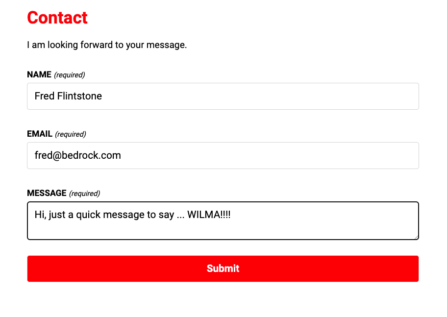
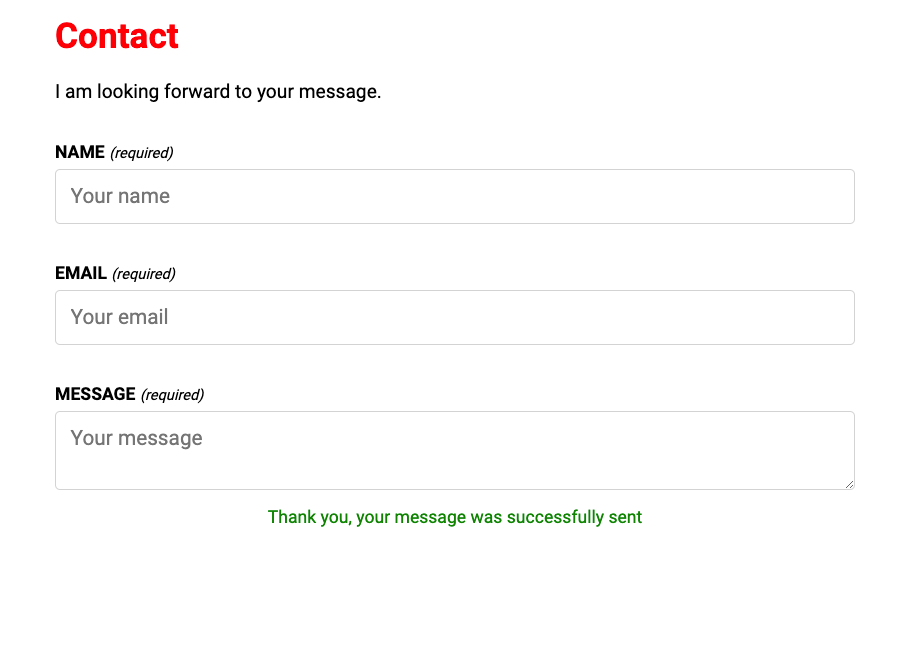

# Contact form component

### Tech used

-   React
-   JavaScript
-   Styled Components
-   Node
-   Express
-   Nodemailer
-   Express validitor
-   DOTENV env variables
-   Built with Vite

### Instructions

1. git clone repo
2. cd client
3. npm install
4. npm run dev (frontend - client)
5. cd server
6. npm install
7. npm run server:dev (backend - server)
8. Open browser and go to http://localhost:3000

### Screenshot - Contact Form

### Screenshot - Successfully Sent Form

